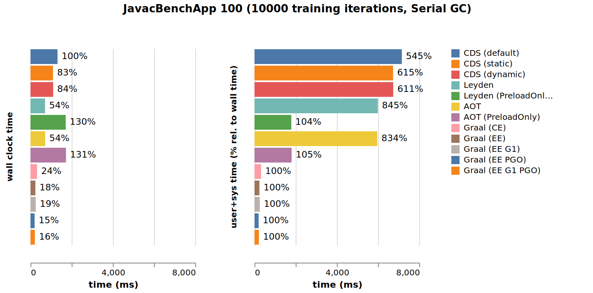
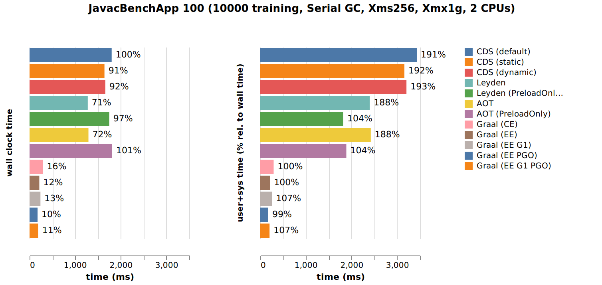
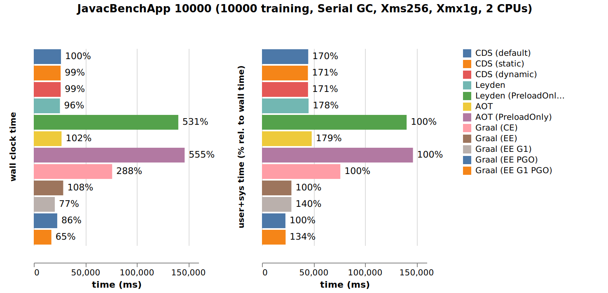

## Leyden vs. Graal Native Image

This is a preliminary (as of March 2025) comparison of the CPU and memory consumption of the simple [`JavacBenchApp`](https://github.com/openjdk/leyden/blob/8204ccbc0161306295d6c433e0048f7bba8c9041/test/hotspot/jtreg/runtime/cds/appcds/applications/JavacBenchApp.java) application from Leyden's JTreg tests. The program uses the `javax.tools` interface to programmatically compile a variable number of Java classes created from a string template and tries to exercise a fair amount of `javac` features. The number of compiled classes can be given as a command line parameter. At the end of its execution, the program dynamically loads one of the compiled classes and calls a method from it.

Read on for the details about what the following graph is actually displaying and how it was created :)


### Test modifications

The original test uses [`Lookup.defineClass(byte [])`](https://docs.oracle.com/en/java/javase/23/docs/api/java.base/java/lang/invoke/MethodHandles.Lookup.html#defineClass(byte[])) to dynamically load a compiled class in the current class loader. This isn't currently supported by Native Image, but Native Image has [experimental support for dynamic class loading](https://www.graalvm.org/jdk23/reference-manual/native-image/metadata/ExperimentalAgentOptions/#support-for-predefined-classes) with the help of their [Tracing Agent](https://www.graalvm.org/jdk23/reference-manual/native-image/metadata/AutomaticMetadataCollection/). However, this only works for classes not loaded by one of the Java VM’s built-in class loaders, so I slightly changed the test to dynamically load the class into an anonymous custom class loader:

```patch
@@ -196,8 +196,15 @@ void setup(int count) {

     @SuppressWarnings("unchecked")
     static void validate(byte[] sanityClassFile) throws Throwable {
-        MethodHandles.Lookup lookup = MethodHandles.lookup();
-        Class<?> cls = lookup.defineClass(sanityClassFile);
+        Class<?> cls = new ClassLoader() {
+            public Class findClass(String name) {
+                return defineClass(name, sanityClassFile, 0, sanityClassFile.length);
+            }
+        }.findClass("Sanity");
         Callable<String> obj = (Callable<String>)cls.getDeclaredConstructor().newInstance();
         String s = obj.call();
         if (!s.equals("this is a test")) {
```
Also, because the Native Image tool uses an old version of `org.objectweb.asm`, it can't parse Java 25 class files. I therefore changed the test to produce Java 21 class files instead:

```patch
@@ -99,7 +99,7 @@ public Map<String, byte[]> compile() {
         Collection<SourceFile> sourceFiles = sources;

         try (FileManager fileManager = new FileManager(compiler.getStandardFileManager(ds, null, null))) {
-            JavaCompiler.CompilationTask task = compiler.getTask(null, fileManager, null, null, null, sourceFiles);
+            JavaCompiler.CompilationTask task = compiler.getTask(null, fileManager, null, List.of("--release", "21"), null, sourceFiles);
             if (task.call()) {
                 return fileManager.getCompiledClasses();
             } else {
```

These changes can be found in my private [JavacBenchApp-for-GraalNativeImage](https://github.com/simonis/leyden/blob/JavacBenchApp-for-GraalNativeImage/test/hotspot/jtreg/runtime/cds/appcds/applications/JavacBenchApp.java) branch of Leyden/premain.

### Test environment

For the Leyden tests I used a private build of the Leyden [premain](https://github.com/openjdk/leyden/tree/premain) branch at commit [432069bf72a](https://github.com/openjdk/leyden/commit/432069bf72af6c26a922a0fe9a6b20b06c7c0599) with the test changes described before.

For the Graal Native Image tests I used a private build of the [Graal master branch](https://github.com/oracle/graal) at commit [3cae6b41a41](https://github.com/oracle/graal/commit/3cae6b41a41119d0694f53ec84d703db56d96325) (built with [OpenJDK master](https://github.com/openjdk/jdk) at commit [bd112c4fab8](https://github.com/openjdk/jdk/commit/bd112c4fab8c6b6a8181d4629009b6cb408727a1)) for Graal CE and the early access version of [Oracle GraalVM for JDK 25 - 25.0.0-ea11](https://github.com/graalvm/oracle-graalvm-ea-builds/releases/tag/jdk-25.0.0-ea.11) for Graal EE.

Notice that Leyden as well as Graal Native Image are under heavy development, so the current comparison can only be a snapshot!

For measuring the runtime (i.e. wall clock, user and system time), I used [`hyperfine`](https://github.com/sharkdp/hyperfine) and for measuring RSS I used [`/usr/bin/time -f %M`](https://man7.org/linux/man-pages/man1/time.1.html).

All the benchmarks were taken on an empty [c5.metal](https://instances.vantage.sh/aws/ec2/c5.metal) instance with an Intel Xeon Platinum 8275L with 48 cores / 96 hyperthreads running at 3.00GHz and 192gb of main memory on Amazon Linux 2023.6.20250115.

### Test modes

In JTreg, `JavacBenchApp` is executed by the [`JavacBench`](https://github.com/openjdk/leyden/blob/8204ccbc0161306295d6c433e0048f7bba8c9041/test/hotspot/jtreg/runtime/cds/appcds/applications/JavacBench.java) in four modes, STATIC, DYNAMIC, LEYDEN and AOT. In the following sections I'll summarize what these modes mean. The last line in each sections describes how the benchmarks was actually run.

**DEFAULT**

This is java from the Leyden repository but running without any Leyden-specific enhancements. It uses the default CDS archive which is created at build time and should more or less behave the same like a vanilla OpenJDK build (OpenJDK upstream is merged frequently into the `premain` branch of the Leyden repository).

**STATIC**
```
$ java -Xshare:off -XX:DumpLoadedClassList=JavacBench.classlist -cp JavacBenchApp.jar JavacBenchApp 90
$ java -Xshare:dump -XX:SharedArchiveFile=JavacBench.static.jsa -XX:SharedClassListFile=JavacBench.classlist -cp JavacBenchApp.jar JavacBenchApp 90
$ java -Xshare:on -XX:SharedArchiveFile=JavacBench.static.jsa -cp JavacBenchApp.jar JavacBenchApp <iterations>
```

**DYNAMIC**
```
$ java -XX:ArchiveClassesAtExit=JavacBench.dynamic.jsa -cp JavacBenchApp.jar JavacBenchApp 90
$ java -Xshare:on -XX:SharedArchiveFile=JavacBench.dynamic.jsa -cp JavacBenchApp.jar JavacBenchApp <iterations>
```

**LEYDEN**
```
$ java -XX:+AOTClassLinking -XX:+ArchiveDynamicProxies -XX:CacheDataStore=JavacBench.cds -cp JavacBenchApp.jar JavacBenchApp 90
$ java -XX:CacheDataStore=JavacBench.cds -cp JavacBenchApp.jar JavacBenchApp 90
```

**AOT**
```
$ java -XX:AOTMode=record -XX:AOTConfiguration=JavacBench.aotconfig -cp JavacBenchApp.jar JavacBenchApp 90
$ java -XX:AOTMode=create -XX:AOTConfiguration=JavacBench.aotconfig -XX:AOTCache=JavacBench.aot -cp JavacBenchApp.jar JavacBenchApp 90
$ java -XX:AOTMode=on -XX:AOTCache=JavacBench.aot -cp JavacBenchApp.jar JavacBenchApp <iterations>
```

The LEYDEN/AOT mode was executed two times, once with the default settings and once with [`-XX:+PreloadOnly`](https://github.com/openjdk/leyden/pull/44).

For Graal Native Image CE and EE I prepared the native executables as follows:

**GRAAL CE/EE**
```
$ java -agentlib:native-image-agent=config-output-dir=libnative-image-agent-class,experimental-class-define-support -cp JavacBenchApp.jar JavacBenchApp 90
$ mkdir -p libnative-image-agent-class/META-INF/native-image
$ cp -rf libnative-image-agent-class/agent-extracted-predefined-classes libnative-image-agent-class/*.json libnative-image-agent-class/META-INF/native-image/
$ native-image -H:+UnlockExperimentalVMOptions -H:+AllowJRTFileSystem -cp libnative-image-agent-class -cp JavacBenchApp.jar JavacBenchApp JavacBenchApp.exe
```

For Graal EE I also created executable with G1 and [Profile Guided Optimization](https://www.graalvm.org/latest/reference-manual/native-image/guides/optimize-native-executable-with-pgo/) (PGO) as follows:

**GRALL EE G1**
```
...<as before>..
$ native-image -H:+UnlockExperimentalVMOptions -H:+AllowJRTFileSystem --gc=G1 -cp libnative-image-agent-class -cp JavacBenchApp.jar JavacBenchApp JavacBenchApp.exe
```

**GRALL EE PGO**
```
...<as before>..
$ native-image -H:+UnlockExperimentalVMOptions -H:+AllowJRTFileSystem --pgo-instrument -cp libnative-image-agent-class -cp JavacBenchApp.jar JavacBenchApp JavacBenchApp-instrumented.exe
$ JavacBenchApp-instrumented.exe -Djava.home=$JAVA_HOME -XX:ProfilesDumpFile=default.iprof 90
$ native-image -H:+UnlockExperimentalVMOptions -H:+AllowJRTFileSystem --pgo=default.iprof -cp libnative-image-agent-class -cp JavacBenchApp.jar JavacBenchApp JavacBenchApp.exe
```

**GRALL EE G1 PGO**
```
...<as before>..
$ native-image -H:+UnlockExperimentalVMOptions -H:+AllowJRTFileSystem  --gc=G1 --pgo-instrument -cp libnative-image-agent-class -cp JavacBenchApp.jar JavacBenchApp JavacBenchApp-instrumented.exe
$ JavacBenchApp-instrumented.exe -Djava.home=$JAVA_HOME -XX:ProfilesDumpFile=g1.iprof 90
$ native-image -H:+UnlockExperimentalVMOptions -H:+AllowJRTFileSystem  --gc=G1 --pgo=g1.iprof -cp libnative-image-agent-class -cp JavacBenchApp.jar JavacBenchApp JavacBenchApp.exe
```

When running the created native executables we have to manually set the `java.home` property on the command line with `-Djava.home=<JAVA_HOME>` to avoid null pointer exceptions because a [native image doesn't have `java.home` set by default](https://www.graalvm.org/latest/reference-manual/native-image/guides/troubleshoot-run-time-errors/#2-set-javahome-explicitly).

For the run-time benchmarks I did run each mode 30 times and for measuring RSS, each mode was executed 10 times.

The exact commands can be found in the [scripts/run.sh](./scripts/run.sh) script which was used to build and run the test. It can be run as follows from the top-level directory of this repository:
```bash
$ BUILD=true TIME=TRUE MEMORY=true ./scripts/run.sh
```
The script expects the the environment variables `LEYDEN_HOME`, `LEYDEN_SRC`, `GRAALCE_HOME` and `GRAALEE_HOME` are set accordingly and `hperfine` is in the path. It will create the directory `./build/` directory for all the required build artefacts and place all the raw benchmarks data under `./build/data/`. The CPU time benchmarks end in `.csv`, the RSS measurement end in `.rss`. All the data files from a single invocation of `run.sh` contain the same time stamp as part of their file name. Setting the environment variable `DEBUG` to true will echo each command on the console before executing it.

### Results

#### CPU usage

Following are the results for running `JavacBench 1`:


The left graph shows the wall clock time for each configuration. "CDS (default)" is java from the Leyden `premain` branch with the default CDS archive created during the build and should be equivalent to the corresponding version of OpenJDK. Its wall clock time is set to 100%. All the other percentage labels in the left graph denote the relative runtime compared to the "CDS (default)" mode.

The right graph displays the sum of user plus system time for the respective configurations in the left graph. Notice that each percentage label on the right graph shows the proportion of user and system time compared to the wall clock time of the same configuration in the left graph. E.g. `JavacBench 1` runs 526ms in the "CDS (default)" mode (upper, blue bar in the left graph) but it consumes 1411ms of user and system time (upper blue bar in the right graph) which is 268% of the wall clock time. This means that `JavacBench 1` used ~2.6 CPUs during its run time. As mentioned in the [Test environment](#test-environment) section, these tests where running on a machine with plenty of free cores, so the proportion of wall clock time to user time shows the "parallelism" of the application (or to be more precise, the parallelism of the JVM because the application itself is single threaded). So the additional user time basically accounts for concurrent JIT and GC activity.

The graph for running `JavacBench 100` looks as follows:


And finally the graph for compiling 10000 classes with `JavacBench 100`:


#### Memory usage

Following are the results for running `JavacBench 1`:


The graph for running `JavacBench 100` looks as follows:


And finally the graph for compiling 10000 classes with `JavacBench 100`:


#### Interpreting the results

First of all, this benchmark is not strictly measuring startup time or time to peak performance. It measures the end-to-end time of an application from start to exit. However, for a small workload like the javac compilation of a single class (i.e. `JavacBenchApp 1`) it is still a good approximation for the startup time of `javac` (neglecting anomalies like [JDK-8349927](https://bugs.openjdk.org/browse/JDK-8349927)).

Second, the benchmarks were run with the default JVM settings (except for the two Graal EE runs which explicitly select G1 GC). This means that all HotSpot JVMs run with the default G1 GC and a relatively big heap of 2gb/30gb  InitialHeapSize/MaxHeapSize because the machine has plenty of RAM available. This huge heap itself can already result in a measurable startup overhead due to the initialization of the required G1 data structures (see [JDK-8348278](https://bugs.openjdk.org/browse/JDK-8348278) and [JDK-8348270](https://bugs.openjdk.org/browse/JDK-8348270)). Native Image runs with Serial GC by default and only the EE version supports G1 GC.

Looking at the CPU usage for the run with one compilation, we can see that the current Leyden/AOT implementation already cuts down the execution time to 43% but Graal Native Image CE/EE is still significantly faster and requires just about 9%/6% of the default HotSpot execution time. Notice however, how the HotSpot runs have a ~three times higher user time. This means that there's still a significant amount of concurrent work going on. For the single compilation case, that's mostly JIT activity. This can be verified by looking at the [-XX:+PreloadOnly](https://github.com/openjdk/leyden/pull/44) runs where the user time is not much higher than the wall clock time because it disables profiling and therefore doesn't trigger any JIT compilations as well as recompilations of AOT compiled code (at the cost of less effective code). For the Native Image case, wall clock time is equal to user time because there's no JIT or other concurrent activity going on (except for the G1 GC GraalEE runs for 10000 compilations where the concurrently running GC is clearly visible).

The more files we compile, the more the advantage of using Graal Native Image decreases. E.g. for 100 compilations, Graal CE already requires 24% of the time of the default OpenJDK run while at 10000 compilations the executable produced by Graal CE exe already runs twice as long as the application on HotSpot. Only Graal EE with G1 GC is on par with HotSpot for 10000 compilations and finally Graal EE with G1 and PGO even beats HotSpot by ~14%.

The reason why Leyden/AOT is ~10 slower than HotSpot for 10000 compilations although it still spends a considerable amount of time doing JIT compilations requires more investigation.

##### Profiling

It's also interesting to look at the profiling flamegraphs for the various runs. For the default CDS run with one compilation we can see that we spend about 65% of the total CPU time in the C1 and C2 JIT compiler threads (you can click on the image below to get a more detailed, searchable and zoomable version of the flamegraph):

[](https://htmlpreview.github.io/?https://github.com/simonis/LeydenVsGraalNative/blob/main/flamegraphs/2025-03-16-19-29/CDS-default-1-2025-03-16-19-29.html)

If we compare this with the corresponding Leyden profile:

[](https://htmlpreview.github.io/?https://github.com/simonis/LeydenVsGraalNative/blob/main/flamegraphs/2025-03-16-19-29/Leyden-1-2025-03-16-19-29.html)

We can see that although the Leyden version is overall much faster, it still spends more than 70% of the CPU time in the JIT compilers. If we look more closely, we can even identify additional, Leyden-specific  compiler threads named "C1 SC CompilerThread" and "C2 SC CompilerThread".

It is also interesting to create a Leyden profile with directly with `perf` and [FlameGraph](https://github.com/brendangregg/FlameGraph) instead of [AsyncProfiler](https://github.com/async-profiler/async-profiler):


In order to make it possible for `perf` to walk Java stacks, we have to run with `-XX:+PreserveFramePointer` and with [`-XX:+DumpPerfMapAtExit`](https://bugs.openjdk.org/browse/JDK-8255383) in order to make the names of JIT compiled methods known to `perf` through so called [perf map files](https://github.com/torvalds/linux/blob/master/tools/perf/Documentation/jit-interface.txt). While the perf generated flamegraph looks quite similar to the one created with AsyncProfiler (modulo the color scheme), we still see a significant amount (~13%) of unknown Java frames, although we ran with `-XX:+PreserveFramePointer`. This is because with Leyden, we must not only run `-XX:+PreserveFramePointer`, but also created the CDS/AOT archive with this option because it now contains precompiled methods. If we do this, the unknown frames mostly go away:


Another interesting property of the `perf` generated flamegraphs is that they more clearly identify interpreter frames (in AsynProfiler they are color-coded in light green, but only if running with `cstack=vm`).

With this knowledge, we can use them to distinguish JIT-compiled methods which come from the CDS archive (i.e. the ones denoted as "unknown" if the archive was created without `-XX:+PreserveFramePointer`) from the once (re-)compiled at runtime.

If we profile the executable generated by Graal Native Image when doing a single compilation, we can clearly see the advantage of AOT compilation for small workloads:


When we increase the number of compiled methods to 10000, the G1 GC threads start to dominate the CPU usage in the flamegraphs for both, Leyden:

[](https://htmlpreview.github.io/?https://github.com/simonis/LeydenVsGraalNative/blob/main/flamegraphs/2025-03-16-19-29/Leyden-10000-2025-03-16-19-29.html)

as well as native images generated with Graal EE and G1:


With Graal CE and Serial GC, the GC frames are hidden inside the normal Java frames and you can see them when searching for `com.oracle.svm.core.genscavenge` in the flame graph:


You can find the flamegraphs of other configurations in the [./flamegraphs](./flamegraphs/) subdirectory.
#### Increasing the number of training iterations

The following graphs are taken with the same settings as before, except that the number of warmup iterations for creating the CDS/Leyden/AOT archives and the PGO executables has been increased from 90 to 10000.


The effects of increasing the number of training iterations is overall quite small. Interestingly, it seem to slightly worsen the Leyden/AOT time for running one/hundred compilations and only shows positive effects for 10000 compilations.

The results for the memory consumption change in a similar way. You can click on the graphs below to get a larger version of them:
|  |  |  |
|-------|------|------|

#### Using Serial GC

The following graphs are taken with the same settings as before, except that the number of warmup iterations for creating the CDS/Leyden/AOT archives and the PGO executables has been increased from 90 to 10000 and all the HotSpot runs were executed with Serial GC instead of the default G1 GC.





As expected, switching to Serial GC slightly improves the performance of the HotSpot runs for 1/100 compilations while slowing it down for 10000 compilations. The benefit is that CPU utilization (i.e. user time) for 10000 compilations decreases because no concurrent GC work is done. Interestingly, user time for 10000 compilations is still ~2.5 times higher (compared to ~4 times for the G1 configuration) than wall clock time and this all accounts to JIT compilation overhead.

For the memory consumption, the differences between G1 and Serial GC become evident for 10000 compilations, where with Serial GC, the JVM consumes just about half as much memory as with G1 GC:
|  |  |  |
|-------|------|------|

#### Running with Serial GC and `-Xms256m -Xmx1g` on two CPUs

These are the graphs of another benchmark run with 10000 warmup iterations and Serial GC but with a manually configured heap size of `-Xms256m -Xmx1g` running on just two CPUs (i.e. `taskset -c 8,9`).





User plus system time now naturally stays below 200% wall clock time because we simply do not have additional CPUs for concurrent work (i.e. JIT compilations or GC in the case of the Graal EE runs which use G1 GC). This slows down the HotSpot results because now it takes even longer until the peak-optimized versions of the JIT compiled methods become available whereas it doesn't affect the Native Image executables thus further increasing the advantage of Native Image compared to Hotspot. There's a single anomaly for Graal CE with 10000 compilations which takes about twice as long as the corresponding Graal CE run with default settings. This might be related to Serial GC not working so efficiently with the smaller `MaxHeapSize` of 1g compared to 30g when running with default settings.

Below you can find the memory consumption graphs for this configuration:

|  |  |  |
|-------|------|------|

Again, it's the Graal CE generated executable that stands out because it uses almost 2g RSS although the `MaxHeapSize` was configured to be 1g. It looks like something is using plenty of off-heap storage. Again, this might be related to Serial GC but requires deeper investigations.

### Appendix

#### Creating the graphs

Disclaimer: this workflow is quite specific to this exact use case and will hardly work out of the box for anything else !!!

For the CPU time graphs, the raw data files (e.g. [`./data/2025-03-04-09-04/AOT-2025-03-04-09-04.csv`](data/2025-03-04-09-04/AOT-2025-03-04-09-04.csv)) are first processed and converted into [vega-lite](https://vega.github.io/vega-lite/) specification with the help of [`./scripts/ProcessHyperfineResults.java`](scripts/ProcessHyperfineResults.java) as follows:

```bash
$ java ./scripts/ProcessHyperfineResults.java 10000 scripts/TemplateJavacBenchAppCPU.json /tmp/JavacBenchApp10000.json ./data/2025-03-04-09-04/*.csv
```
The first argument (i.e. `10000` in this example) is the argument given to the `JavacBenchApp` (because each `.csv` file contains the data for one configuration but for runs with different parameters), the second argument is the vega-lie template file to use, the third argument denotes the output file (i.e. the created vega-lite specification) and the remaining arguments (usually a wildcard expression) are the raw input data files created by [`./scripts/run.sh`](scripts/run.sh)

For the memory consumption graphs, the raw data files (e.g. [`./data/2025-03-04-15-40/AOT-1-2025-03-04-15-40.rss`](data/2025-03-04-15-40/AOT-1-2025-03-04-15-40.rss)) are first processed and converted into [vega-lite](https://vega.github.io/vega-lite/) specification with the help of [`./scripts/ProcessRssResults.java`](scripts/ProcessRssResults.java) as follows:

```bash
$ java ./scripts/ProcessRssResults.java 10000 scripts/TemplateJavacBenchAppRSS_horizontal.json graphs/2025-03-04-15-40/JavacBenchAppRSS10000.json data/2025-03-04-15-40/*.rss
```

The vega-lite specifications are then transformed into SVG graphs as follows. First we create a Docker container with the vega-lite toolchain as follows:
```bash
$ docker build -t vega-lite -f scripts/Dockerfile.vega .
```

Once the container has been created, we can use it as follows to create SVG graphs from the vega-lite specifications:
```bash
$ docker run --rm -i vega-lite --scale 2 < vega-lite-spec.json > graph.svg
```
