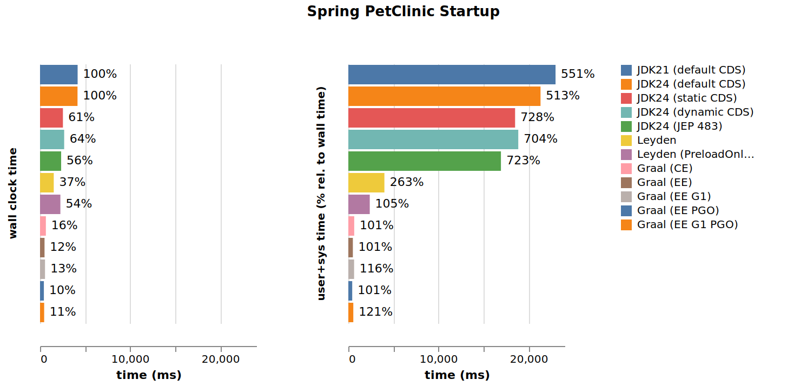
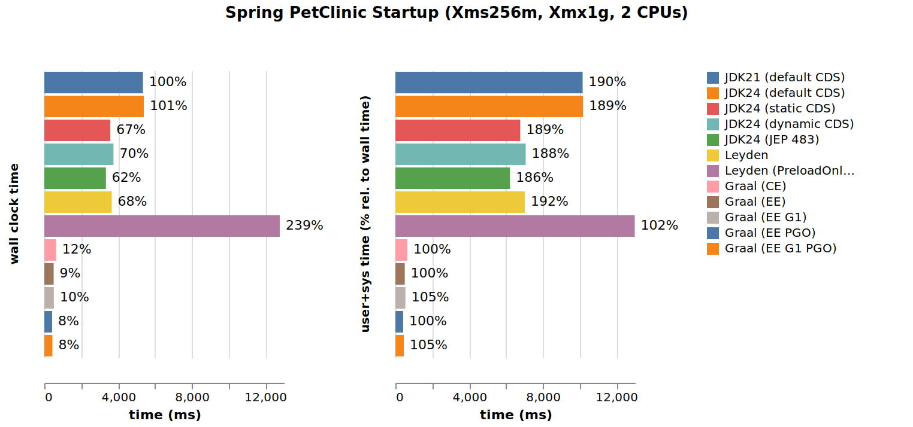
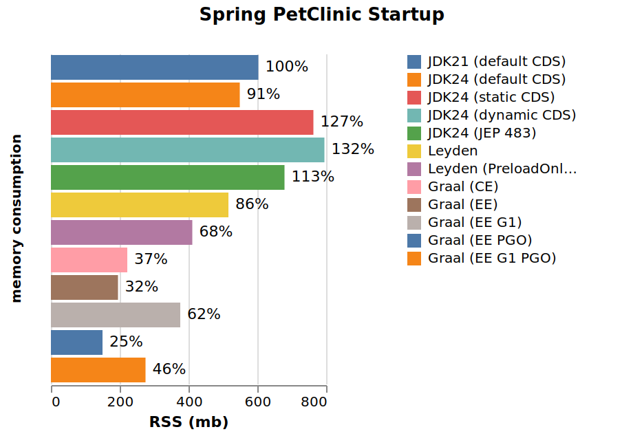
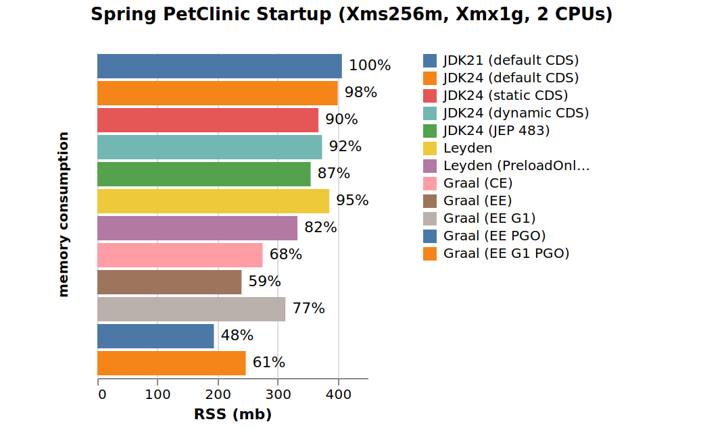

## Leyden vs. Graal Native Image

This is a preliminary (as of May 2025) comparison of the Leyden and GraalVM CPU and memory consumption when running the [PetClinic](https://github.com/spring-projects/spring-petclinic) version from the [Leyden premain](https://github.com/openjdk/leyden/tree/premain) branch test directory [`test/hotspot/jtreg/premain/spring-petclinic`](https://github.com/openjdk/leyden/tree/premain/test/hotspot/jtreg/premain/spring-petclinic).

